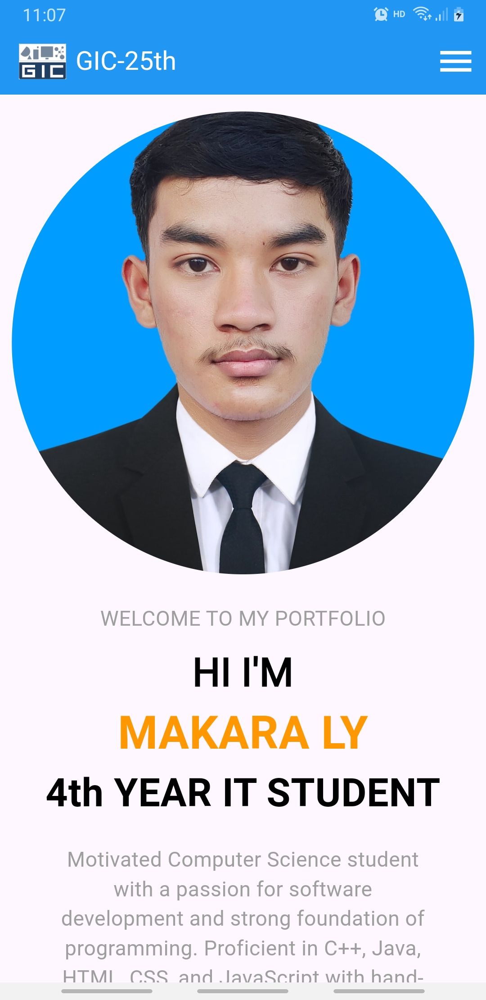

# makara_porfolio

<p align="center">
  
  
</p>

## Getting Started

This project is a starting point for a Flutter application.

## Feature about the app

- Navbar have logo and huberger button
- A pofile picture in the middle
- A few text align center of the screen
- Button ```Hire Me``` will direct to my telegram contact
- Button ```Download CV``` will download my CV

A few resources to get you started if this is your first Flutter project:

- [Lab: Write your first Flutter app](https://docs.flutter.dev/get-started/codelab)
- [Cookbook: Useful Flutter samples](https://docs.flutter.dev/cookbook)

For help getting started with Flutter development, view the
[online documentation](https://docs.flutter.dev/), which offers tutorials,
samples, guidance on mobile development, and a full API reference.
