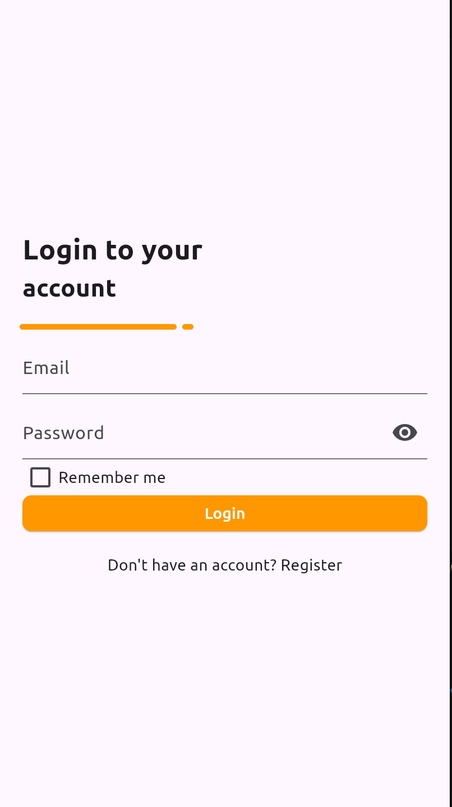
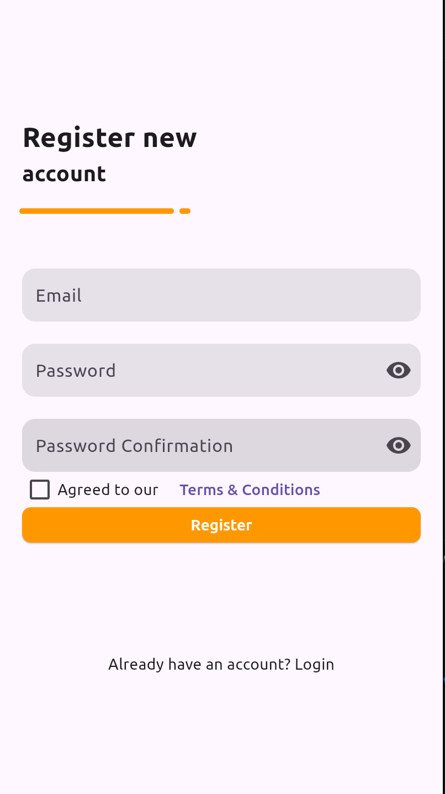

# Authentication Screen

  
  

## Overview

This Flutter project demonstrates a simple authentication UI with separate login and registration screens. It includes the following features:
- Login screen with email and password fields, and a "Remember me" checkbox.
- Registration screen with email, password, and password confirmation fields, along with a "Terms & Conditions" agreement checkbox.
- Navigation between the login and registration screens.
- Custom dashed line decoration for visual styling.

## Features

- **Login Screen**:
  - Email and password input fields.
  - "Remember me" checkbox.
  - Login button.
  - Navigation link to the registration screen.

- **Registration Screen**:
  - Email, password, and password confirmation input fields.
  - "Terms & Conditions" agreement checkbox.
  - Register button.
  - Navigation link back to the login screen.

- **Custom UI**:
  - Dashed line decoration using a custom painter.
  - Responsive design for different screen sizes.

## Folder Structure

The project follows a simple structure for better organization:
